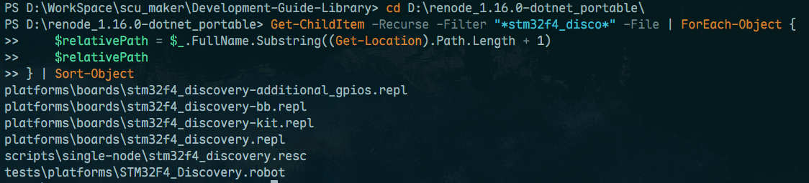
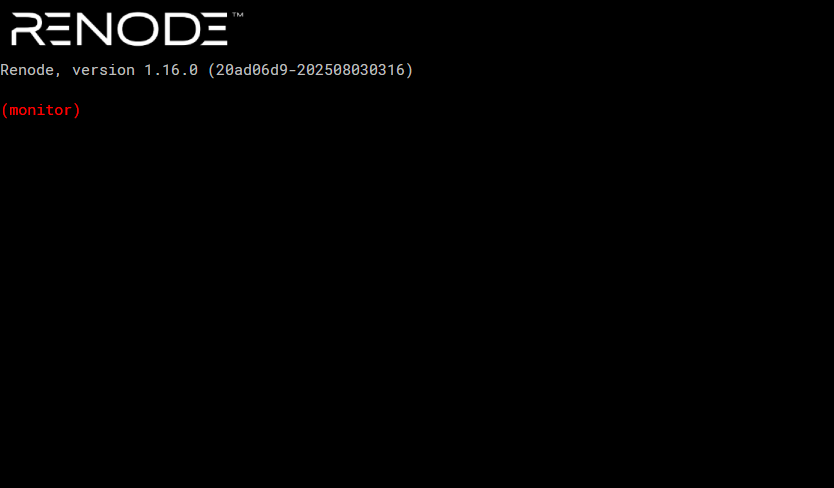
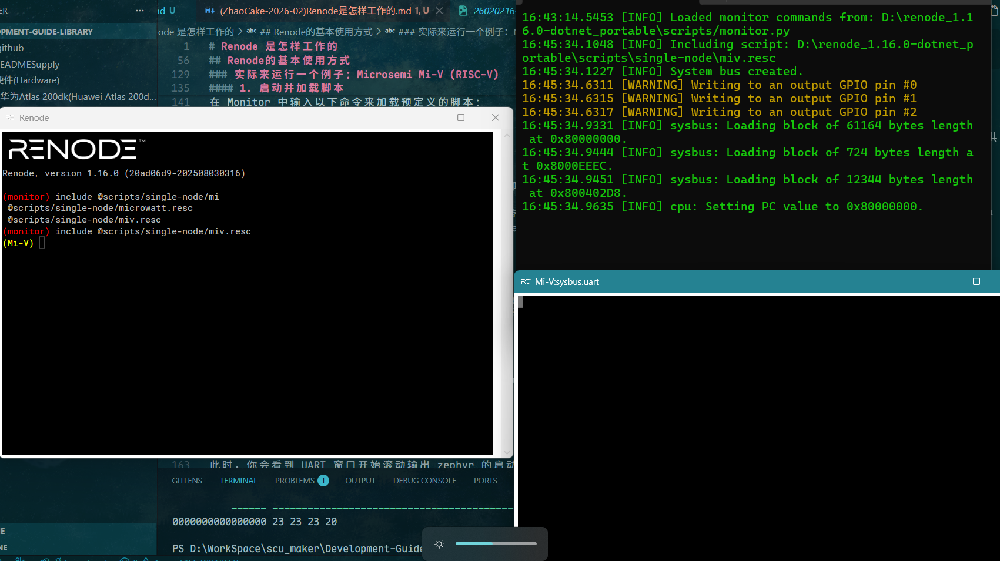

# Renode 是怎样工作的

要学习Renode，首先需要明确Renode是什么，为什么要用Renode而不是其他的仿真工具。
这就需要理解Renode的工作逻辑。

## 为什么使用Renode？

### Renode与Qemu对比

在仿真领域，QEMU 无疑是行业老大哥，但 Renode 的出现并不是为了重复造轮子，而是为了解决现代嵌入式开发（特别是 IoT）中 QEMU 难以覆盖的痛点。

我们可以把 QEMU 比作“高性能跑车”，而把 Renode 比作“高精度乐高积木”。

| 维度 | QEMU (传统强者) | Renode (现代 IoT 仿真) |
| :--- | :--- | :--- |
| **核心定位** | **操作系统级仿真**。侧重于让另一个架构的 OS（如 Linux）在你的电脑上跑起来，追求速度。 | **系统/板级仿真**。侧重于模拟整个硬件系统（CPU + 外设 + 传感器 + 网络），追求可控性和可观测性。 |
| **配置方式** | **硬编码 (C语言)**。如果你想模拟一块新开发板，通常需要修改 QEMU 源码并重新编译，门槛极高。 | **文本配置 (.repl)**。通过人类可读的文本文件定义硬件（如 `0x4000: uart @ sysbus`），像搭积木一样拼装 SoC。 |
| **多节点支持** | **困难**。通常一个 QEMU 进程模拟一个设备，想模拟多台设备组网非常复杂。 | **原生支持**。可以在一个仿真环境中同时运行数十个节点（如 1 个网关 + 10 个传感器），并模拟它们之间的无线通信。 |
| **扩展性** | 修改源码，重新编译。 | 支持 Python/C# 脚本动态扩展，支持热插拔外设模型。 |
| **确定性** | 较难保证。多线程可能导致每次运行的时序微小差异。 | **严格确定性**。只要输入相同，无论运行多少次，指令执行的顺序和时间戳毫秒不差（对复现 Bug 至关重要）。 |

### Renode与Proteus对比

我们来谈谈很多人都用过的Proteus。它确实开创了一种直观的模拟方式：从元件库中拖拽一个ATmega328P或8051，像画电路图一样连接LED、按钮和液晶屏，然后加载固件进行仿真。这种基于引脚和原理图的交互逻辑，非常适合理解单片机级的简单系统。

然而，当我们把目光投向现代嵌入式开发的主流——以Arm Cortex-M/R/A、RISC-V为代表的复杂SoC（System on Chip）时，Proteus的模型就显得“抱残守缺”、力不从心了。 这并非仅仅因为它支持的芯片型号老旧、更新缓慢，更深层的原因在于其底层的仿真范式已经与现代SoC的开发方式脱节。

Proteus进行的是原理图/PCB这一级的电平的仿真。而现代SoC的开发绝大多数关键外设（如UART、I2C、DMA、定时器）并非通过外部引脚与CPU连接，而是通过片内系统总线（如AHB、APB）直接与核心交换数据。这是一种更高层次、更高效的“内存映射I/O”通信。Proteus的引脚模型无法直观描述这种复杂的片内互联网络，强行用“虚拟导线”连接会变得极其复杂且不真实。并且Proteus也不能够适应当前的自动化的需求，图形的、拖拽的配置方式，显然是低效且难以自动工作的。

Proteus代表了以离散元器件和单片机为中心的旧时代仿真哲学。而现代嵌入式开发已经进入了以集成SoC和系统为核心的时代。Renode的诞生，正是为了应对这一转变。它摒弃了过时的“连线”思维，拥抱了“总线映射”和“系统描述”的范式，提供了与当代软硬件开发流程（如DevOps、Shift-Left测试）无缝衔接的能力。

### Renode是更现代的嵌入式仿真哲学

Renode 的设计哲学是 “将硬件抽象为软件对象”。基于这一理念，它带来了三大核心优势：

1. 声明式硬件定义 (Declarative Hardware)： 使用 .repl (Renode Platform) 文件，你可以用类似配置文件的语法，在几分钟内定义出一个全新的 SoC 或开发板，而无需编写一行 C 代码。
2. 强大的内省与控制 (Introspection & Control)： Renode 暴露了所有的内部状态。你可以随时暂停整个“世界”，查看任意寄存器、内存，甚至用 Python 脚本去“修改”传感器的数据（例如上一节提到的注入虚假温度数据）。
3. 异构多节点仿真： 它可以在同一个模拟世界中，同时运行 RISC-V 的传感器、ARM Cortex-M 的控制器和 x86 的服务器，并模拟它们之间的蓝牙、Wi-Fi 或以太网通信。

在前面的导览中，我们也提到了，Renode尽管当前在国内名声不显，实际上在不少大型项目中已经有了很多应用。

但是对于一个学生而言，我认为Renode最关键的是给予了学生对于嵌入式更透明的视角。很多同学在嵌入式开发的过程当中更关注如何把功能
跑起来，而没有在其背后的计算机体系结构方面做更多的关注，而这实际上很重要。Renode 不仅仅是一个“替代物理开发板”的工具，更是一个“计算机体系结构显微镜”。在没有Renode之前的实践中，我们可能需要自己在FPGA上跑软核、深入QEMU的源码才能看到的东西，现在Renode可以轻易看到了。

我不妨先问这样几个问题：

1. 大家都知道 CPU 是按照它的 PC（程序计数器）指针在跑，那么系统上电的第一瞬间，你的这个 PC 值是从哪里来的呢？是谁告诉它的？
2. 为什么在开发板上通过拨动所谓的 BOOT 跳线帽，就可以修改从哪里启动（Flash 还是 RAM）？这在电路和逻辑层面究竟是怎样实现的？
3. 为什么我们在 C 语言里向一个特定的内存地址赋值（比如 *GPIO_ODR = 0x01），LED 灯就会亮，或者串口就会发出数据？在 CPU 眼里，内存条（RAM）和外设寄存器到底有什么区别？

在学生阶段的开发中，我们往往使用arduino、stm32等等所谓生态较好的设备，也就是说我们见到其实是一个经过抽象的软件库，对于我们来说，
基于库的编程实际上已经和纯软件的编程没有特别大的差别，需要注意的往往是如何协调性能而不是如何bringup一个Baremetal的开发环境。
但我想，深入到软硬件协同开发的这个视角，是完全有必要的。

## Renode的基本使用方式

本节介绍 Renode 的安装以及文件结构。

### 安装与运行（Windows）

对于 Windows 用户，Renode 推荐使用其 **Portable (.NET version)** 版本。

- **为什么推荐？** 传统的安装版通常依赖于系统安装的 .NET 环境，有时会因为版本不匹配导致各种玄学问题。而 `Portable` 版本包含了独立的 `.NET` 运行环境，解压缩即用，不会污染系统，且更容易备份和移动。(*并且改源码也会更随便*)
- **获取方式：** 前往 [Renode GitHub Releases](https://github.com/renode/renode/releases)，下载文件名形如 `renode-x.y.z.dotnet-portable.zip` 的压缩包。
- **运行：** 解压后，直接运行 `renode.exe` 即可启动控制台（Monitor）。

### 揭秘 Renode 的文件结构

Renode 的仿真过程通常由三种核心文件驱动：以 `stm32f4_discovery` 为例，我们可以清晰地看到它们的职责分工。



#### 1. `.resc` (Renode Script) —— 仿真脚本

`.resc` 文件是仿真的入口。它的作用像是一份“剧本”，告诉 Renode 应该搭建什么样的舞台，选用哪些演员（硬件），以及什么时候开始表演。

如果你去查阅 Renode 内置的 `stm32f4_discovery.resc`，你会发现其精简后的逻辑如下：

```renode
# 1. 创建一台机器（Machine）
mach create "stm32f4_discovery"

# 2. 加载硬件描述文件（.repl）
machine LoadPlatformDescription @platforms/boards/stm32f4_discovery-kit.repl

# 3. 设置启动属性或外设查看窗口
showAnalyzer sysbus.uart2

# 4. 加载编译好的固件（ELF 或 BIN）
sysbus LoadELF @xxxxxx.elf
```

**总结：** `.resc` 负责环境搭建（创建机器、设置连接、加载固件）。

#### 2. `.repl` (Renode Platform) —— 硬件描述

`.repl` 文件定义了真实的硬件长什么样。比如 CPU 是什么型号、Flash 在哪里、UART 的寄存器地址是多少。

它描述的是**内存映射（Memory Map）**。在 `stm32f4_discovery.repl` 中，你会看到类似的定义：

```renode
// 定义内存
flash: Memory.MappedMemory @ sysbus 0x08000000
    size: 0x100000

sram: Memory.MappedMemory @ sysbus 0x20000000
    size: 0x20000

// 定义外设并将其挂载到系统总线（sysbus）的特定地址
uart2: UART.STM32_UART @ sysbus 0x40004400
    IRQ -> nvic@38
```

这种声明式的定义极其强大：你甚至不需要懂 C 语言或硬件设计，只要照着芯片手册（Datasheet）把地址和中断号填进去，就能“凭空”造出一块开发板。

这种明明白白的系统内部总线视角正是单纯调库实现功能所缺乏的视角。

#### 3. 固件文件 (`.elf` / `.bin`) —— 运行代码

这是你使用 Keil、STM32CubeIDE 或 VS Code 编译出来的可执行文件。Renode 会模拟 CPU 执行这些二进制指令。

理解了上述结构，你就会发现 Renode 的工作路径非常清晰：

1. **开发者编写代码**并编译生成 `.elf`。
2. **`.repl` 文件**告诉 Renode 硬件是什么样的（地址映射等）。
3. **`.resc` 脚本**把硬件组装好，把 `.elf` 塞进 Flash 模拟运行。

这种“软硬分离”的设计，使得我们可以通过修改 `.repl` 在一秒钟内改变硬件配置（比如把 128KB 的 RAM 改成 512KB），而无需像传统仿真器（如qemu）那样重新编译仿真引擎。

### 实际来运行一个例子：Microsemi Mi-V (RISC-V)

为了直观感受 Renode 的工作流程，我们以官方文档中的 **Microsemi Mi-V**（基于 RISC-V 架构） demo 为例。这个例子展示了如何从零开始带起一个运行 LiteOS 的仿真环境。

> **注：** 本节参考自 [Renode 官方教程 - Mi-V example](https://renode.readthedocs.io/en/latest/tutorials/miv-example.html)。

#### 1. 启动并加载脚本

在启动 Renode 后，你会看到一个名为 **Monitor** 的黑色控制台。这是你与仿真世界互动的主要窗口。



在 Monitor 中输入以下命令来加载预定义的脚本：

```renode
include @scripts/single-node/miv.resc
```

- `include` (或简写为 `i`)：告诉 Renode 执行一个脚本。
- `@`：在 Renode 路径语法中，`@` 代表路径的起点。
- `scripts/single-node/miv.resc`：这是 Renode 自带的脚本。它会按照上一节提到的逻辑：创建机器 -> 加载 .repl 描述 -> 注入官方提供的 .elf 固件。

#### 2. 观察输出



如果你执行成功，Renode 会自动弹出一个 **UART Analyzer** 窗口。这个窗口模拟了真实开发板的串口调试助手，所有的 printf 输出都会在这里显示。

#### 3. 控制仿真

加载完成后，仿真默认是暂停状态。你需要在 Monitor 中输入：

```renode
start
```

此时，你会看到 UART 窗口开始滚动输出 zephyr 的启动日志。
你可以随时输入 `pause` 暂停世界，或者输入 `logLevel 0`（即 Debug 级）来在日志窗口看到更详细的运行信息。


#### 4. 结束仿真

要想结束仿真，输入：

```renode
quit
```

如果只是想清理当前machine而不结束monitor，输入：

```renode
Clear
```
